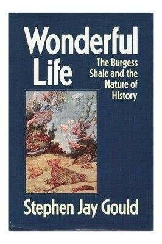

```{r setup, include=FALSE}
options(htmltools.dir.version = FALSE)
knitr::opts_chunk$set(collapse = TRUE,
                      fig.retina = 3)

library(ymlthis)
library(tidyverse)
```

layout: true

---

class: title-slide, center, bottom

# `r rmarkdown::metadata$title`

## `r rmarkdown::metadata$subtitle`

### `r rmarkdown::metadata$author`

---
name: clouds
class: center, middle
background-image: url(images/Clouds.jpg)
background-size: cover

```{r meta, echo=FALSE}
library(metathis)
meta() %>%
  meta_general(
    description = "Slides para aulas teóricas da disciplina BIE5798 na USP sobre reprodutibilidade computacional e ciência aberta",
    generator = "xaringan and remark.js"
  ) %>% 
  meta_name("github-repo" = "GabrielNakamura/USP_BIE5798_apresentacoes") %>% 
  meta_social(
    title = "Boas Práticas e Ferramentas da Ciência Aberta na Ecologia",
    url = "https://github.com/GabrielNakamura/USP_BIE5798_apresentacoes",
    image = "",
    image_alt = "The first slide features the presentation tile with a figure centered on the top illustrating an antique world map",
    og_type = "website",
    twitter_card_type = "summary_large_image"
  )
```

---
template: clouds

## Olá! Quem somos

???
apresentação pessoal

---
template: clouds

## Reprodutibilidade

???
apresentação pessoal

---

name: clouds
class: center, middle
background-image: url(images/Clouds.jpg)
background-size: cover

## Reprodutibilidade 


```{r echo=FALSE, out.width="80%", fig.alt= "Capas dos três livros Lord of The Rings"}
 knitr::include_graphics("images/LOTR01.png")
```


???
It populate our imaginary and is very present in our lives mainly through movies and some fancy speculations that explore this possibility 

---
name: clouds
class: center, middle
background-image: url(images/Clouds.jpg)
background-size: cover

## Reprodutibilidade: Por que?


.pull-left[
```{r echo=FALSE, out.width="60%", fig.alt= "Foto com logo do aplicativo de encontro Tinder"}
 knitr::include_graphics("images/app_encontro.png")
```
]

.pull-right[
```{r echo=FALSE, out.width="60%", fig.alt= "foto de michael scott de The Office no tinder"}
 knitr::include_graphics("images/MichaelScott-tinder.jpeg")
```
]

???
But, why we have such fascination about time travel topics? First, of all I believe that is a matter of intrinsically curiosity to discover something that is resembles a fiction history, imagine how incredible would be to travel in time inside the Tardis, the success of Dr. Who series reflect a little bit our fascination

---
name: clouds
class: center, midle
background-image: url(images/Clouds.jpg)
background-size: cover

## Reprodutibilidade: a importância do processo


???
Historical events matters a lot if we want to understand the current forms and distributions of life on earth

---
name: clouds
class: center, midle
background-image: url(images/Clouds.jpg)
background-size: cover

## Metadados

???
apresentação pessoal

---
name: clouds
class: center, midle
background-image: url(images/Clouds.jpg)
background-size: cover

## Metadados: XML, EML e outros


---
name: clouds
class: center, midle
background-image: url(images/Clouds.jpg)
background-size: cover

## Organização local: questão de estilo?


---
name: clouds
class: center, midle
background-image: url(images/Clouds.jpg)
background-size: cover

## Modelo mínimo para organização local

---
name: clouds
class: center, midle
background-image: url(images/Clouds.jpg)
background-size: cover

## Ferramentas para organização local


---
name: clouds
class: center, midle
background-image: url(images/Clouds.jpg)
background-size: cover

## Ferramentas para organização local: boas práticas e ferramentas para organização de scripts

---
name: clouds
class: center, midle
background-image: url(images/Clouds.jpg)
background-size: cover

## Ferramentas para organização local: projetos


---
name: clouds
class: center, midle
background-image: url(images/Clouds.jpg)
background-size: cover

## Controle de versão e repositório remoto


---
name: clouds
class: center, midle
background-image: url(images/Clouds.jpg)
background-size: cover

## Controle de versão e repositório remoto: Git, GitHub e RStudio


---
name: clouds
class: center, midle
background-image: url(images/Clouds.jpg)
background-size: cover

## Controle de versão e repositório remoto: Git, GitHub e RStudio (prática)


---
name: clouds
class: center, midle
background-image: url(images/Clouds.jpg)
background-size: cover

## Controle de versão: novos nomes para velhos conhecidos


---
name: clouds
class: center, midle
background-image: url(images/Clouds.jpg)
background-size: cover

## Indo além do artigo: literate programming


---
name: clouds
class: center, midle
background-image: url(images/Clouds.jpg)
background-size: cover


```{r echo=FALSE, out.width="85%", fig.alt= "A painting illustrating Darwin's finches"}



```

]
]

]
