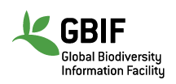
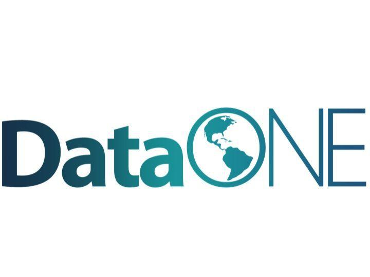

```{r setup, include=FALSE}
options(htmltools.dir.version = FALSE)
knitr::opts_chunk$set(collapse = TRUE,
                      fig.retina = 3)

library(ymlthis)
library(tidyverse)
```

layout: true

---

class: title-slide, center, bottom

# `r rmarkdown::metadata$title`

## `r rmarkdown::metadata$subtitle`

### `r rmarkdown::metadata$author`

---
name: clouds
class: center, middle
background-image: url(images/Clouds.jpg)
background-size: cover

```{r meta, echo=FALSE}
library(metathis)
meta() %>%
  meta_general(
    description = "Slides para aulas teóricas da disciplina BIE5798 na USP sobre reprodutibilidade computacional e ciência aberta",
    generator = "xaringan and remark.js"
  ) %>% 
  meta_name("github-repo" = "GabrielNakamura/USP_BIE5798_apresentacoes") %>% 
  meta_social(
    title = "Boas Práticas e Ferramentas da Ciência Aberta na Ecologia",
    url = "https://github.com/GabrielNakamura/USP_BIE5798_apresentacoes",
    image = "",
    image_alt = "The first slide features the presentation tile with a figure centered on the top illustrating an antique world map",
    og_type = "website",
    twitter_card_type = "summary_large_image"
  )
```

---
template: clouds

## Olá! Quem somos

### Gabriel

--

```{r echo=FALSE, out.width="30%", fig.alt= "Tweet com uma ave e uma pessoa dizendo que é especialista em aves"}
 knitr::include_graphics("images/thisIsBird.jpeg")
```

???
apresentação pessoal

---
template: clouds

## Reprodutibilidade

???
apresentação pessoal

---

name: clouds
class: center, middle
background-image: url(images/Clouds.jpg)
background-size: cover

## Reprodutibilidade 


```{r echo=FALSE, out.width="80%", fig.alt= "Capas dos três livros Lord of The Rings"}
 
```


???
It populate our imaginary and is very present in our lives mainly through movies and some fancy speculations that explore this possibility 

---
name: clouds
class: center, middle
background-image: url(images/Clouds.jpg)
background-size: cover

## Reprodutibilidade: Por que?


.pull-left[
```{r echo=FALSE, out.width="60%", fig.alt= "Foto com logo do aplicativo de encontro Tinder"}
 knitr::include_graphics("images/app_encontro.png")
```
]

.pull-right[
```{r echo=FALSE, out.width="60%", fig.alt= "foto de michael scott de The Office no tinder"}
 knitr::include_graphics("images/MichaelScott-tinder.jpeg")
```
]

???
But, why we have such fascination about time travel topics? First, of all I believe that is a matter of intrinsically curiosity to discover something that is resembles a fiction history, imagine how incredible would be to travel in time inside the Tardis, the success of Dr. Who series reflect a little bit our fascination

---
name: clouds
class: center, midle
background-image: url(images/Clouds.jpg)
background-size: cover

## Reprodutibilidade: a importância do processo


```{r echo=FALSE, eval=TRUE,out.width="50%"}


```


???
Historical events matters a lot if we want to understand the current forms and distributions of life on earth

---
name: clouds
class: center, midle
background-image: url(images/Clouds.jpg)
background-size: cover

## Reprodutibilidade: a importância do processo


???
Historical events matters a lot if we want to understand the current forms and distributions of life on earth

---
name: clouds
class: center, midle
background-image: url(images/Clouds.jpg)
background-size: cover

## Metadados

???
metadados e pacote xml

---
name: clouds
class: center, midle
background-image: url(images/Clouds.jpg)
background-size: cover

## Metadados: XML, EML e outros

### O que estes sites tem em comum?


```{r echo=FALSE,eval=TRUE,out.width="20%"}

```

```{r echo=FALSE,eval=TRUE,out.width="20%"}

```

```{r echo=FALSE,eval=TRUE,out.width="20%"}

```

---
name: clouds
class: center, midle
background-image: url(images/Clouds.jpg)
background-size: cover

## Metadados: XML, EML e outros

### Por que utilizar?

.pull-left[
```{r echo=FALSE,eval=TRUE,out.width="80%"}
knitr::include_graphics("images/speciesLink-busca.png")
```

```{r echo=FALSE,eval=TRUE,out.width="70%"}

```
]

.pull-right[
- Dados seguindo o **princípio do FAIR **

- Realização de **buscas em repositório**

- Possibilita a **integração e síntese**

- Possibilita a **leitura por humanos e máquinas**
]

---
name: clouds
class: center, midle
background-image: url(images/Clouds.jpg)
background-size: cover

## Metadados: XML, EML e outros

### Montando um XML


```{r echo=FALSE,eval=TRUE,out.width="40%",fig.cap="Uma tabela de dados"}
knitr::include_graphics("images/dado-ex-1.png")
```

---
name: clouds
class: center, midle
background-image: url(images/Clouds.jpg)
background-size: cover

## Metadados: XML, EML e outros

### Montando um XML - descrevendo atributos


```{r echo=FALSE,eval=TRUE,out.width="35%",fig.cap="Uma tabela de dados"}

```

---
name: clouds
class: center, midle
background-image: url(images/Clouds.jpg)
background-size: cover

## Metadados: XML, EML e outros

### Montando um XML - descrevendo atributos

```{r echo=FALSE,eval=TRUE,out.width="35%",fig.cap="Uma tabela de dados"}

```

---
name: clouds
class: center, midle
background-image: url(images/Clouds.jpg)
background-size: cover

## Metadados: XML, EML e outros

### Montando um XML - descrevendo atributos

```{r echo=FALSE,eval=TRUE,out.width="35%",fig.cap="Uma tabela de dados"}

```

---
name: clouds
class: center, midle
background-image: url(images/Clouds.jpg)
background-size: cover

## Metadados: XML, EML e outros

### Montando um XML - mais atributos

```{r echo=FALSE,eval=TRUE,out.width="50%"}

```

---
name: clouds
class: center, midle
background-image: url(images/Clouds.jpg)
background-size: cover

## Metadados: XML, EML e outros

### Montando um XML - empacotando tudo

```{r echo=FALSE,eval=TRUE,out.width="80%"}
knitr::include_graphics("images/dado-ex-6.png")
```

---
name: clouds
class: center, midle
background-image: url(images/Clouds.jpg)
background-size: cover

## Metadados: XML, EML e outros

### [Prática](https://gabrielnakamura.github.io/USP_reproducibility_BIE5791/Organizacao_dir_local.html#Metadados_na_pr%C3%A1tica_-_utilizando_o_pacote_{EML})


---
name: clouds
class: center, midle
background-image: url(images/Clouds.jpg)
background-size: cover

## Organização local: questão de estilo?

> Na minha bagunça eu me encontro...

```{r echo=FALSE,eval=TRUE,out.width="60%"}
knitr::include_graphics("images/quarto_desorganizado.jpeg")
```

---
name: clouds
class: center, midle
background-image: url(images/Clouds.jpg)
background-size: cover

## Modelo mínimo para organização local

---
name: clouds
class: center, midle
background-image: url(images/Clouds.jpg)
background-size: cover

## Ferramentas para organização local

### nomeando coisas (Inspirado no [trabalho](http://www2.stat.duke.edu/~rcs46/lectures_2015/01-markdown-git/slides/naming-slides/naming-slides.pdf) da Jenny Brian)

.pull-left[
```{r echo=FALSE}
 knitr::include_url("http://www2.stat.duke.edu/~rcs46/lectures_2015/01-markdown-git/slides/naming-slides/naming-slides.pdf")
```

]

.pull-right[
- possível ser lido por máquinas 
    + fácil procura
    + informações podem ser extraídas do nome (splitting)

- possível ser lido por humanos 
    + informações de conteúdo

- segue uma **ordem** lógica

- ISO 8601 para datas
    + AAAA-MM-DD 
]
---
name: clouds
class: center, midle
background-image: url(images/Clouds.jpg)
background-size: cover

## Ferramentas para organização local: boas práticas e ferramentas para organização de scripts

---
name: clouds
class: center, midle
background-image: url(images/Clouds.jpg)
background-size: cover

## Ferramentas para organização local: projetos e caminhos

.pull-left[
```{r echo=FALSE, out.width="80%", fig.alt= "Tweet de hadley wickham desencorajando o uso sobre setwd e getwd em scripts de R"}
 knitr::include_graphics("images/Hadley_advice.jpeg")
```
]

.pull-right[
```{r echo=FALSE, out.width="100%", fig.alt= "Um coelho e um rato aflitos com um computador ao meio deles em chamas"}
 knitr::include_graphics("images/set-fire-computer.jpeg")
```
]

---
name: clouds
class: center, midle
background-image: url(images/Clouds.jpg)
background-size: cover

## Ferramentas para organização local: projetos e caminhos

### Caminhos absolutos e relativos

.pull-left[

```{r echo=FALSE, out.width="50%", fig.alt= ""}

```

]

.pull-right[

- Computadores distintos, nomes distintos

- Caminho absoluto: 
```{r eval=FALSE}
setwd("/Users/gabrielnakamura/OneDrive/Disciplina_Praticas_ferramentas_gestao_dados")
```


]

---
name: clouds
class: center, midle
background-image: url(images/Clouds.jpg)
background-size: cover

## Ferramentas para organização local: projetos e caminhos

### Caminhos absolutos e relativos

.pull-left[

```{r echo=FALSE, out.width="80%", fig.alt= ""}

```

]

.pull-right[

- Computadores distintos, nomes distintos

- Caminho absoluto: 
```{r eval=FALSE}
setwd("/Users/gabrielnakamura/OneDrive/Disciplina_Praticas_ferramentas_gestao_dados")
```

- Caminho relativo:
```{r eval=FALSE}
setwd("images/relative-path.png")
```

]

---
name: clouds
class: center, midle
background-image: url(images/Clouds.jpg)
background-size: cover

## Ferramentas para organização local: projetos e caminhos

### Solução Rproject + pacote `here`

.pull-left[
- RStudio: **"enraiza"** o diretório, ex

```{r echo=TRUE,eval=TRUE}
getwd()
```

]

.pull-right[
- here: **padroniza** caminhos ex:

```{r out.width="30%",echo=TRUE,eval=TRUE}
library(here)
knitr::include_graphics(here("images", "here-package-alisson.png")) 
```

]

---
name: clouds
class: center, midle
background-image: url(images/Clouds.jpg)
background-size: cover

## Ferramentas para organização local: projetos e caminhos

### Solução Rproject + pacote `here` - Resumindo

.pull-left[

- Daqui em diante: Rproject + here

```{r out.width="60%",echo=TRUE,eval=TRUE}
knitr::include_graphics("images/cracked_setwd.png")
```

]

.pull-right[
- **NUNCA MAIS USAR `setwd()` 

```{r out.width="60%",echo=TRUE,eval=TRUE}
knitr::include_graphics("images/set-fire-computer.jpeg")
```
]
---
name: clouds
class: center, midle
background-image: url(images/Clouds.jpg)
background-size: cover

## Controle de versão e repositório remoto: Git, GitHub e RStudio

### Novos nomes para velhos conhecidos

```{r eval=TRUE,echo=FALSE,out.width="65%"}
knitr::include_graphics("images/version-control-all.png")
```


---
name: clouds
class: center, midle
background-image: url(images/Clouds.jpg)
background-size: cover

## Controle de versão e repositório remoto: Git, GitHub e RStudio

### Novos nomes para velhos conhecidos

.pull-left[
```{r eval=TRUE,echo=FALSE,out.width="80%"}
knitr::include_graphics("images/version-control-all.png")
```
]

.pull-right[
- Push e Pull: sincronizando diretórios

- working directory e remote repository: pastas locais e remotas

- Commit: track changes

- branch: "pastas" colaborativas
]

---
name: clouds
class: center, midle
background-image: url(images/Clouds.jpg)
background-size: cover

## Controle de versão e repositório remoto: Git, GitHub e RStudio 

### O que é Git, GitHub e quais diferenças?

.pull-left[

```{r eval=TRUE,echo=FALSE,out.width="100%"}
knitr::include_graphics("images/git_logo.png")
```
**Controle de versão** (track-changes)
]

.pull-right[

```{r eval=TRUE,echo=FALSE,out.width="80%"}
knitr::include_graphics("images/github-mark.png")

```

**Repositório** (nuvem)
]


---
name: clouds
class: center, midle
background-image: url(images/Clouds.jpg)
background-size: cover

## Controle de versão e repositório remoto: Git, GitHub e RStudio 

### O que é Git, GitHub e quais diferenças?

.pull-left[

```{r eval=TRUE,echo=FALSE,out.width="100%"}
knitr::include_graphics("images/git_logo.png")
```
]

.pull-right[

- Concebido para grandes projetos colaborativos (Linux)

- Executa todo o controle de versões

- Funciona independente de um repositório remoto 


]

---
name: clouds
class: center, midle
background-image: url(images/Clouds.jpg)
background-size: cover

## Controle de versão e repositório remoto: Git, GitHub e RStudio 

### O que é Git, GitHub e quais diferenças?

.pull-left[

```{r eval=TRUE,echo=FALSE,out.width="100%"}
knitr::include_graphics("images/github-mark.png")
```
]

.pull-right[

- Repositório remoto (a nuvem)

- Outros tipos de repositório (ex. GitKraken)

- Inúmeras funcionalidades (Vizualização, armazenamento, colaboração etc.)

```{r eval=TRUE,echo=FALSE,out.width="50%"}

```

]

---
name: clouds
class: center, midle
background-image: url(images/Clouds.jpg)
background-size: cover

## Controle de versão e repositório remoto: Git, GitHub e RStudio 

### O que é Git, GitHub e quais diferenças?

.pull-left[

```{r eval=TRUE,echo=FALSE,out.width="100%"}
knitr::include_graphics("images/mee314108-fig-0002-m.jpeg")
```
]

.pull-right[


- Inúmeras funcionalidades (Vizualização, armazenamento, colaboração etc.)

```{r eval=TRUE,echo=FALSE,out.width="60%"}

```

]

---
name: clouds
class: center, midle
background-image: url(images/Clouds.jpg)
background-size: cover

## Controle de versão e repositório remoto: Git, GitHub e RStudio 

### E o RStudio?

```{r echo=FALSE, out.width="70%"}
 knitr::include_graphics("images/Fusao_Git_R.png")
```

---
name: clouds
class: center, midle
background-image: url(images/Clouds.jpg)
background-size: cover

## Controle de versão e repositório remoto: Git, GitHub e RStudio 

### E o RStudio?

.pull-left[
```{r echo=FALSE, out.width="90%"}
 knitr::include_graphics("images/Fusao_Git_R.png")
```
]

.pull-right[
- Funciona como um client integrado
    + faz o track-changes
    + faz os commits
    + faz os pull e push
    + faz TUDO em um só lugar
]

---
name: clouds
class: center, midle
background-image: url(images/Clouds.jpg)
background-size: cover

## Controle de versão: [em caso de dúvidas](https://happygitwithr.com/)

```{r echo=FALSE, out.width="50%", fig.alt= "Foto de Jenny Brian, que tem cabelos loiros, até o ombro e pele branca"}
 knitr::include_graphics("images/jenny-brian.jpeg")
```

---
name: clouds
class: center, midle
background-image: url(images/Clouds.jpg)
background-size: cover

## Controle de versão: em caso de dúvidas

```{r echo=FALSE, out.width="100%", fig.alt= "Foto do livro digital de jenny brian chamado happy git and github for the useR"}
 knitr::include_graphics("images/happy-git-jenny-brian.png")
```

---
name: clouds
class: center, midle
background-image: url(images/Clouds.jpg)
background-size: cover

## Indo além do artigo: literate programming

### Rmarkdown

```{r echo=FALSE, out.width="55%", fig.alt= "Foto do livro digital de jenny brian chamado happy git and github for the useR"}
 knitr::include_graphics("images/rmarkdown_rockstar.png")
```

---
name: clouds
class: center, midle
background-image: url(images/Clouds.jpg)
background-size: cover

## Indo além do artigo: literate programming

> "Programs are meant to be read by humans and only incidentally for computers to execute."

--

```{r echo=FALSE, out.width="60%", fig.alt= "A painting illustrating Darwin's finches"}

knitr::include_graphics("images/rmarkdown_wizards.png")

```

---
name: clouds
class: center, midle
background-image: url(images/Clouds.jpg)
background-size: cover

## Indo além do artigo: literate programming

### knitr

.pull-left[
```{r echo=FALSE, out.width="100%", fig.alt= "Foto do livro digital de jenny brian chamado happy git and github for the useR"}
 knitr::include_graphics("images/knitr-alison-horst-hill.png")
```
]

.pull-right[
- cria documentos (renderiza) a partir de Rmarkdown (a linha)

- permite inserir códigos e texto e renderizar ambos 

]

---
name: clouds
class: center, midle
background-image: url(images/Clouds.jpg)
background-size: cover

## Indo além do artigo: literate programming

### Por que literate programming?


.pull-left[

```{r echo=FALSE, out.width="100%", fig.alt= "A painting illustrating Darwin's finches"}
knitr::include_graphics("images/rmarkdown_rockstar.png")
```


]


.pull-right[

- Facilita a compreensão dos métodos

- Métodos e execução *integrados*

- *Estende* o que está apresentado nos artigos

- Avançado: *Adeus Office!*

]

---
name: clouds
class: center, midle
background-image: url(images/Clouds.jpg)
background-size: cover

## Indo além do artigo: literate programming

### Exemplo: sítios com material suplementar e mais


.pull-left[

```{r echo=FALSE, eval=TRUE}
knitr::include_url("https://gabrielnakamura.github.io/Herodotools/index.html")
```

]


.pull-right[

- Sites como material suplementar

```{r echo=FALSE, eval=TRUE}
knitr::include_graphics("images/paper-herodotools.png")
```


]

---
name: clouds
class: center, midle
background-image: url(images/Clouds.jpg)
background-size: cover

## Indo além do artigo: literate programming

### Exemplo: sítios com material suplementar e mais


.pull-left[

```{r echo=FALSE, eval=TRUE}
knitr::include_url("https://avrodrigues.shinyapps.io/naturaList/")
```

]


.pull-right[

- Sites como material suplementar

- Sites com ferramentas interativas (ex. demonstração de métodos
)
]

---
name: clouds
class: center, midle
background-image: url(images/Clouds.jpg)
background-size: cover

## Indo além do artigo: literate programming

### Básico (mas extremamente útil)

.pull-left[

### as ferramentas básicas

```{r echo=FALSE, out.width="100%", fig.alt= "A painting illustrating Darwin's finches"}

knitr::include_graphics("images/rmarkdown_wizards.png")

```

]

.pull-right[

- Rmarkdown: 
    + chunks e caracteres especiais
    
- `knitr`: integração

- `pandoc`: conversão

- melhor parte: apenas clicar em **knitr**

]

???
melhor de tudo é que não precisa saber de nada

---
name: clouds
class: center, midle
background-image: url(images/Clouds.jpg)
background-size: cover

## Indo além do artigo: literate programming

### Literate programming - [em caso de dúvida ](https://www.apreshill.com/blog/)

```{r echo=FALSE, eval=TRUE}

knitr::include_url("https://www.apreshill.com/blog/")

```

---
name: clouds
class: center, midle
background-image: url(images/Clouds.jpg)
background-size: cover

## Containers

---
name: clouds
class: center, midle
background-image: url(images/Clouds.jpg)
background-size: cover

## Targets: trabalhos que demandam muito tempo